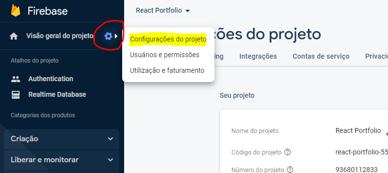
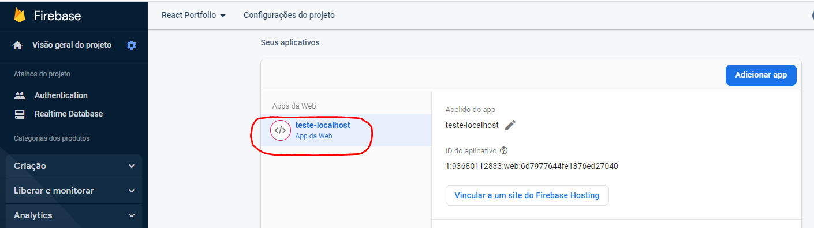
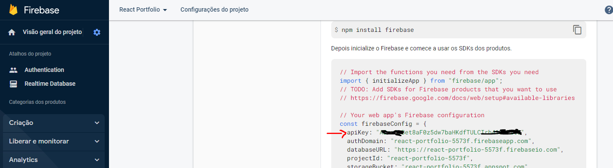
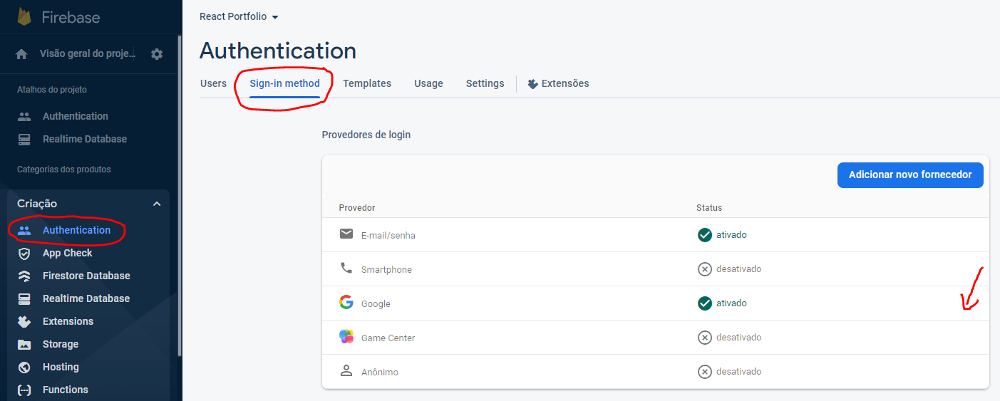
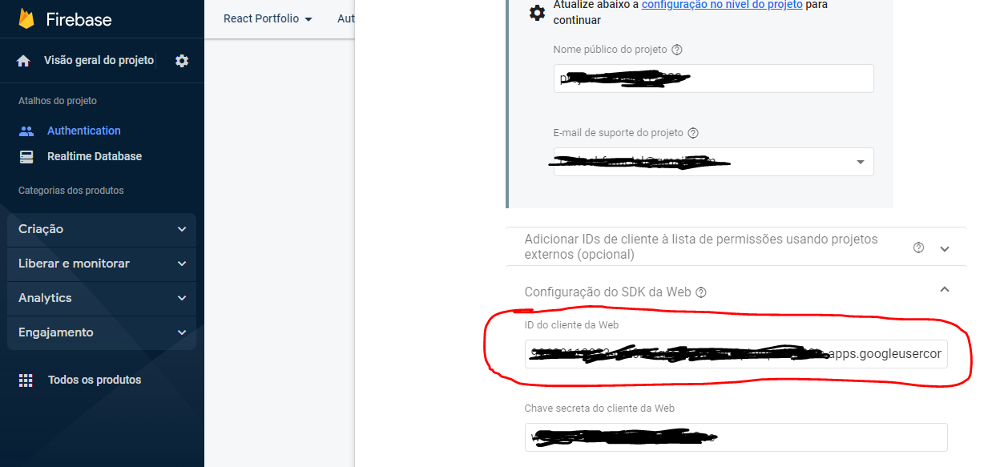
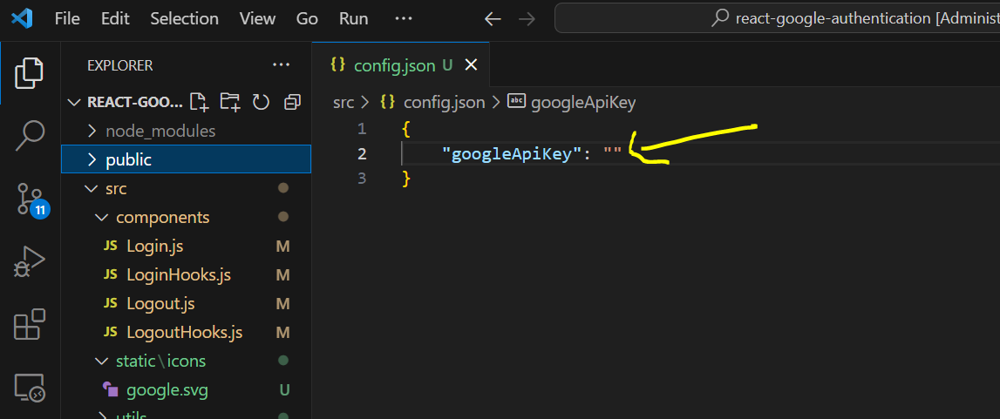
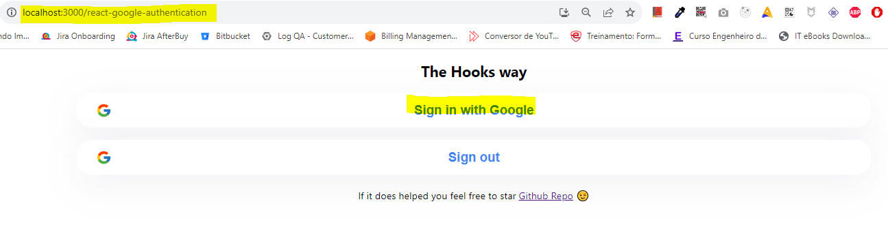
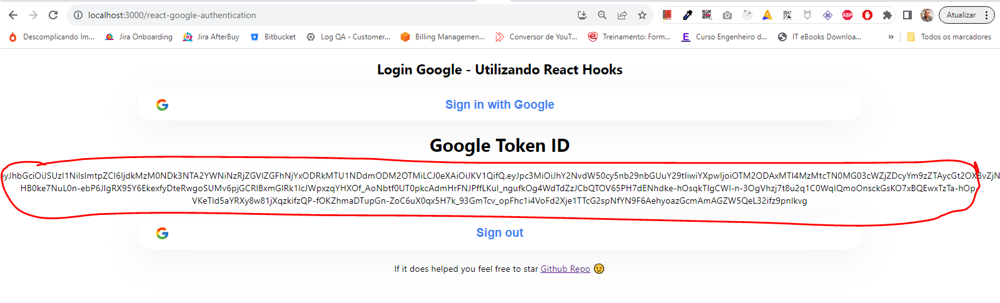

# O que é esse repositório?

Esse repositório foi criado para demonstrar como fazer login no firebase manualmente após ter feito social login no google.

# Como fazer?

1. Ter um projeto firebase configurado
2. Ter no projeto firebase ter um App Web para acesso ao Firebase através de uma apiKey
3. Ter no projeto firebase o Signin Method Google ativado

## Como obter a apiKey de acesso ao Firebase

1. No projeto Firebase, do lado superior esquerdo clique no ícone de engrenagem e clique em **Configurações do Projeto**



2. Na aba Geral, desça até a parte de aplicativos e escolha um do tipo **App da Web**



3. Após isso, será possível visualizar do lado direito uma configuração que conterá uma propriedade **apiKey**



4. Basta copiar essa chave que será usada para conectar no Firebase

## Como obter a apiKey de acesso ao Google

1. No menu lateral esquerdo, clicar na opção Criação > Authentication, clicar na Aba **Sign-in method** e clicar na opção **Editar Configurações** na linha do Google
- Caso o Google não esteja ativado, você deve ativá-lo.



2. Na tela que se abrirá, basta clicar na linha da opção **Configuração do SDK da Web** e copiar a chave do campo **ID do cliente da Web**



## Projeto reactjs

No diretório **react-google-authentication** na raiz desse repositório, contém uma aplicação react simples para fazer login no Google. Após o login o Google retorna para a aplicação um token(que deverá ser enviado depois para o Firebase para executar o login via Google), assim também como informações básicas do usuário que fez o login.

## Instalando o projeto reactjs **react-google-authentication**

1. Para instalar e rodar o projeto é necessário ter instalado
- NodeJs

2. Após isso, basta entrar no diretório **login-firebase-by-google** na raiz desse repo e instalar as dependências do projeto
```
yarn install
```

3. Dentro do projeto, no arquivo **config.json**, na propriedade **googleApiKey** setar a apiKey do Google obtida anteriormente.



4. Startar o projeto
```
yarn start
```

5. Na aplicação, clicar na opção **Sign in with Google**, será aberto uma janela para fazer login no Google.



6. Após o login do Google, será exibido na tela o TokenId do google referente ao login feito. Copie o mesmo.



## Autenticando no Firebase com o Token ID do Google

A api do firebase abaixo tem a seguinte finalidade:

- Dado um token de algum provider(google, twitter, facebook etc...) pós login do usuário
- O Firebase pega esse token, bate no provider, obtém as informações permitidas do usuário
- Caso o usuário não existe no Firebase(nunca tenha feito login no mesmo), o Firebase cria um usuário com os dados obtidos do mesmo e cria uma sessão retornando um token Firebase válido
- Caso o usuário já exista no Firebase(já tenha feito login no mesmo), o Firebase simplesmente cria uma sessão retornando um token Firebase válido
- Com esse token Firebase o usuário estará logado, podendo chamar qualquer aplicação que esteja conectada no mesmo Firebase

**API**

```
POST https://www.googleapis.com/identitytoolkit/v3/relyingparty/verifyAssertion?key={API KEY FIREBASE}
```

**Exemplo Request Body**

Obs: O exemplo abaixo está simulando um login no Firebase com um token do login no Google. Para outros providers(facebook, twitter etc..) pode ser que a propriedade "idToken" tenha que ser substituida por outro nome. Portanto verificar na [documentação firebase](https://firebase.google.com/docs/reference/rest/auth?hl=pt-br).

```json
{
    "postBody": "id_token=[TOKEN ID DO GOOGLE RETORNADO APOS O LOGIN DO USUARIO]&providerId=google.com",
    "requestUri": "http://localhost:8080",
    "returnIdpCredential": true,
    "returnSecureToken": true
}
```

**Exemplo Response Body**

```json
{
    "federatedId": "https://accounts.google.com/109269672778223459903",
    "providerId": "google.com",
    "email": "joaosilva@gmail.com",
    "emailVerified": true,
    "firstName": "João",
    "fullName": "João Silva",
    "lastName": "Silva",
    "photoUrl": "https://lh3.googleusercontent.com/a/ACg8ocKrCQp0h8qV3iW2njwmjd1GU-R4_BdH5eL5amORIkgd3qTK=s96-c",
    "localId": "6EFXF5NqS9SQPZ6F1CfeLSqQ3my2",
    "displayName": "João Silva",
    "idToken": [ID TOKEN DO FIREBASE REFERENTE A SESSAO DO USUARIO LOGADO],
    "expiresIn": "3600",
    "oauthIdToken": "eyJhbGciOiJSUzI1NiIsImtpZCI6IjdkMzM0NDk3N",
    "rawUserInfo": [DADOS OBTIDOS DO USUÁRIO NO GOOGLE],
    "kind": "identitytoolkit#VerifyAssertionResponse"
}
```

A partir deste momento o usuário está logado no Firebase e através da propriedade **idToken** retornado acima é possível chamar outros endpoints referentes ao login do usuário e executar ações de pesquisa dos dados do usuário no Firebase, logout da sessão e etc...
